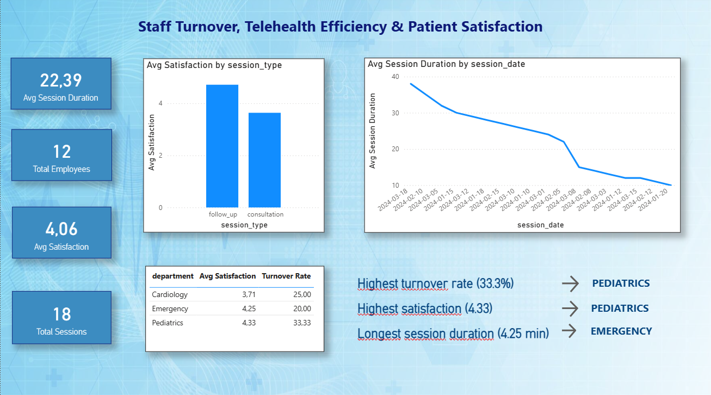

# 🏥 Healthcare Workforce & Telehealth Analytics Dashboard

## 📌 Project Overview

This dashboard analyzes key operational metrics for a healthcare organization, focusing on:
- **Staff turnover rates** by department
- **Telehealth session efficiency** (duration over time)
- **Patient satisfaction** by session type

The goal is to identify areas for improvement in workforce management and telehealth service delivery.

---

## 📊 Key Insights

| Department | Turnover Rate | Avg Satisfaction |
|------------|---------------|------------------|
| Pediatrics | 33.3% | 4.33 |
| Cardiology | 25.0% | 3.71 |
| Emergency | 20.0% | 4.25 |

- **Pediatrics** has the highest turnover but also the highest satisfaction — a potential signal of workload pressure despite good patient outcomes.
- **Emergency** shows balanced performance: low turnover and high satisfaction.
- **Cardiology** has lower satisfaction (3.71) and moderate turnover — an area to investigate.

---

## 📈 Dashboard Preview

---

## 🛠️ Tools Used

- **Power BI Desktop** (Data visualization & DAX measures)
- **Google BigQuery** (Data storage and SQL generation)
- **DAX Measures** created:
  - `Total Employees`
  - `Terminated Employees`
  - `Turnover Rate`
  - `Avg Session Duration`
  - `Avg Satisfaction`

---

## 📂 Data Source

Synthetic data generated with SQL in BigQuery. Two tables:
- `staff_data`: Employee information (role, department, hire/termination dates)
- `telehealth_data`: Session logs (type, duration, satisfaction, date)

---

## 🔍 How to Explore the Dashboard

1. **Hover over charts** to see detailed values
2. **Select departments** in the table to highlight trends
3. **Use the line chart** to observe session duration over time

---

## 📬 Connect with Me

**Miriam González**  
[LinkedIn](https://linkedin.com/in/miriam-gonzalez-a8793a381)  
[GitHub](https://github.com/miriamgp1000-prog)

---

*This project is part of my portfolio as I transition from nursing to healthcare data analytics.*
